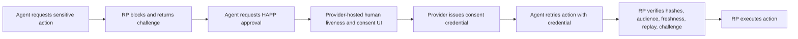

# HAPP: Human Authorization & Presence Protocol


HAPP is an open protocol for proving that a human explicitly approved a specific machine-readable action, with replay-resistant verification at the relying party boundary.

## Quick Start (5 Minutes)

Run the Python reference flow:

```bash
python3 -m venv .venv
source .venv/bin/activate
pip install -r implementations/python/requirements.txt
python implementations/python/bin/run_happ_mcp_server.py
```

In another terminal:

```bash
python implementations/python/examples/demo_mcp_flow.py
```

Run conformance checks:

```bash
python interop/run_conformance.py
```

Run the Lean 4 formal model:

```bash
cd formal
lake build
```

## Why This Exists

Autonomous agents can execute real operations, but current API auth often proves only that a caller is authenticated, not that a human approved this exact action now.

HAPP addresses that gap with portable, verifiable approval evidence bound to:

- the action intent (`intent_hash`)
- what was shown to the human (`presentation_hash`)
- audience and freshness controls (`aud`, `jti`, challenge binding)

## Why This Matters Now

- Agentic systems are moving from read/support actions to high-consequence execution.
- Traditional auth patterns can be bypassed by long-lived delegation paths and headless execution loops.
- Governance and regulatory pressure is increasing for accountability, auditability, and high-risk controls.

HAPP is designed as an interoperable layer that complements existing identity and authorization stacks instead of replacing them.

## Architecture At A Glance



### End-to-End Flow

1. Agent calls RP.
2. RP blocks and issues a challenge when stronger proof is required.
3. Agent requests HAPP approval from a provider.
4. Human completes liveness and explicit approval in provider UI.
5. Provider returns a signed consent credential.
6. Agent retries RP call with credential.
7. RP verifies and atomically consumes replay/challenge state.
8. RP proceeds.

## Project Status

| Area | Status | Notes |
| --- | --- | --- |
| Protocol spec | Draft | Versioned in `specification/draft/` |
| Schemas | Available | Under `schemas/` |
| Python implementation | Reference | Local flow and conformance harness integration |
| Rust implementation | Reference | Multi-crate workspace with provider/RP components |
| Formal verification | In progress | Lean 4 model under `formal/` |
| Production hardening | Not complete | See scoped limitations below |

## Repository Map

- `specification/draft/happ-v0.3.4.md`: Core protocol draft
- `specification/draft/happ-rfc-style-v0.3.4.md`: RFC-style rendering
- `specification/draft/mcp-profile-v0.3.4.md`: MCP profile
- `specification/draft/conformance-v0.3.md`: Conformance requirements
- `schemas/`: JSON schemas for protocol objects
- `test_vectors/`: Sample vectors
- `implementations/python/`: Python reference implementation
- `implementations/rust/`: Rust reference workspace
- `interop/`: Conformance harness
- `formal/`: Lean 4 formal model and proofs

## Security Model (Protocol Intent)

HAPP is designed to mitigate:

- UI/intent mismatch (WYSIWYS via `presentation_hash`)
- replay of approval artifacts (`jti`, TTL, challenge single-use)
- weak linkage between approval and executed action (`intent_hash`)

HAPP does not by itself solve:

- endpoint compromise (agent host or user device)
- all downstream token replay unless combined with sender-constrained token profiles
- coercion or out-of-protocol social engineering

## Reference Implementation Limits (Scoped)

This repository includes reference implementations for interoperability, not production deployment.

Current known limits include:

- simplified key and trust handling in demo paths
- in-memory state for selected flows
- incomplete production controls for distributed replay/state stores, key lifecycle, and revocation/eventing
- hardening gaps documented in code and implementation READMEs

## How HAPP Relates To Existing Standards

HAPP is meant to compose with existing standards:

- OAuth 2.x / OIDC: transport and delegation layers
- MCP: invocation and tool workflow layer
- WebAuthn/FIDO: strong authentication signals
- Verifiable credential ecosystems: portable proof packaging options

HAPP specifically focuses on intent-bound human approval and presence evidence at execution boundaries.

## Ecosystem Links

- Model Context Protocol: https://modelcontextprotocol.io/specification
- OpenID Foundation: https://openid.net/
- OAuth Working Group: https://datatracker.ietf.org/wg/oauth/about/
- W3C Verifiable Credentials: https://www.w3.org/TR/vc-data-model/
- FIDO Alliance / WebAuthn ecosystem: https://fidoalliance.org/
- NIST AI RMF: https://www.nist.gov/itl/ai-risk-management-framework
- EU AI Act portal: https://digital-strategy.ec.europa.eu/en/policies/regulatory-framework-ai

## Contributing

Please read:

- `CONTRIBUTING.md`
- `CODE_OF_CONDUCT.md`

High-value contributions:

- conformance tests and vectors
- verifier hardening
- formal proof coverage expansion
- interoperability reports

## License

Apache-2.0. See `LICENSE`.
