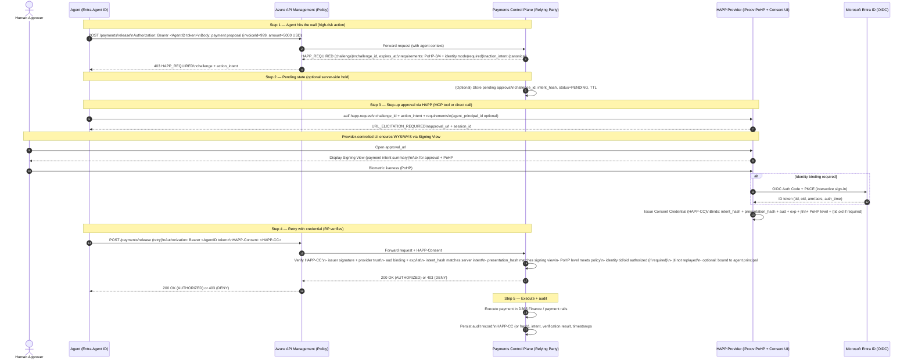

---

## Actors

- **Agent**: running under **Entra Agent ID** (agent/service principal)  
- **RP / Payments Control Plane**: your internal API that ultimately executes (or triggers) the payment in D365 Finance / bank rails  
- **APIM**: policy enforcement point in front of the RP  
- **HAPP Provider (iProov)**: Presence Provider + consent UI + credential issuer  
- **Human Approver**: the person who must approve high‑value actions  
- **Entra ID**: identity provider for binding approval to an enterprise user (optional/required depending on policy)

---

## Structured flow (recommended “RP Challenge + HAPP”)

### Step 1: The Agent Hits the Wall (Trigger)
**Action:** Agent attempts high‑risk operation: “Pay invoice #999 for $5,000.”

**Call:**  
Agent → APIM/RP: `POST /payments/release`  
- **Authorization:** Agent’s Entra access token (Agent ID)  
- **Body:** proposed payment parameters (or invoice reference)

**Policy decision (at APIM/RP):**
- “If amount ≥ threshold OR vendor bank changed recently → require HAPP PoHP‑3/4 (+ identity binding optional/required).”

**Response:** RP returns a **HAPP Challenge** (not the agent “hanging” yet, just a policy response):

- HTTP `403` (or `409`) with `HAPP_REQUIRED`
- includes:
  - `challenge_id`
  - `action_intent` (canonical JSON)
  - requirements: `min_pohp_level`, `identity.mode`, etc.
  - `expires_at` (short TTL)

> Why this is better than “MCP blocks”: the *system that executes the payment* is enforcing the requirement.

---

### Step 2: Pending State (Hold)
You have two reasonable options here:

**Option A — Stateless RP (simpler):**  
The RP doesn’t store “pending.” The challenge is self-contained and short-lived, and the RP will re-check everything when it receives the credential.

**Option B — Stateful RP (better audit / anti-abuse):**  
RP stores a pending record:

- `request_id` / `challenge_id`
- `status=PENDING`
- `intent_hash`
- `risk_context`
- TTL

Either way, the **HAPP Provider** will keep its own session state for the approval UI.

---

### Step 3: Interactive Step‑Up (HAPP execution)
**Agent calls HAPP** (via MCP tool *or* direct API):

Agent → iProov HAPP tool: `aaif.happ.request`  
Inputs:
- `challenge_id` + `action_intent`
- required policy:
  - `pohp_level = PoHP-3/4`
  - `identity.mode = required` (for enterprise approvals)  
- (Optional) agent context: the Agent ID principal ID to bind approval to the agent

**Provider responds with:** “User interaction required” (URL-mode)  
- `session_id` / `elicitation_id`
- `approval_url`

**User experience:**  
- User receives a push/Teams notification or the host shows a “Needs approval” prompt.
- User opens the **provider-controlled UI** (this is key to avoiding UI tampering).

**Within provider UI (Step-up):**
1) Show **Signing View** (the deterministic view of the intent)  
2) Collect **biometric liveness** (iProov PoHP)  
3) If identity required: perform **Entra OIDC Auth Code + PKCE**  
4) Bind together:
   - `intent_hash`
   - `presentation_hash` (hash of exactly what was displayed)
   - `pohp_level` + `verified_at`
   - Entra `tid` + `oid` (if identity required)
   - `aud` = RP identifier
   - short TTL + unique `jti`

Result: issue a **HAPP Consent Credential** (JWT/VC).  
(You can call this “JWC” internally, but in standards terms it’s a HAPP-CC.)

---

### Step 4: Token Exchange / Authorization (Return to RP)
**Agent retries the payment request** with the credential attached:

Agent → APIM/RP: `POST /payments/release`  
- Agent ID token (same as before)  
- Header: `HAPP-Consent: <credential>`

**RP verification checklist (this is your “money moment”):**
- Signature valid and issuer trusted  
- `aud` matches this RP  
- `exp` not expired; credential age within max  
- Recompute `intent_hash` from server-side intent and match  
- Recompute `presentation_hash` from signing view rules and match (prevents UI mismatch)  
- PoHP meets required level  
- If identity required: `tid+oid` present and authorized  
- Replay protection: `jti` not previously used  
- Optional: ensure credential is bound to the same agent principal (Agent ID) that is calling

If valid → `AUTHORIZED`.

---

### Step 5: Agent Execution (Release)
**Execution:** RP performs the payment action in D365 Finance (or triggers downstream workflow).

**Audit:** Store:
- the HAPP Consent Credential (or its hash + metadata)
- the action intent
- verification result
- who approved (if identity required)
- timestamps

One wording tweak: I’d avoid calling it “non-repudiable” in a strict legal sense; I’d describe it as a **tamper-evident, cryptographically verifiable approval record** suitable for audit and investigations.

---
